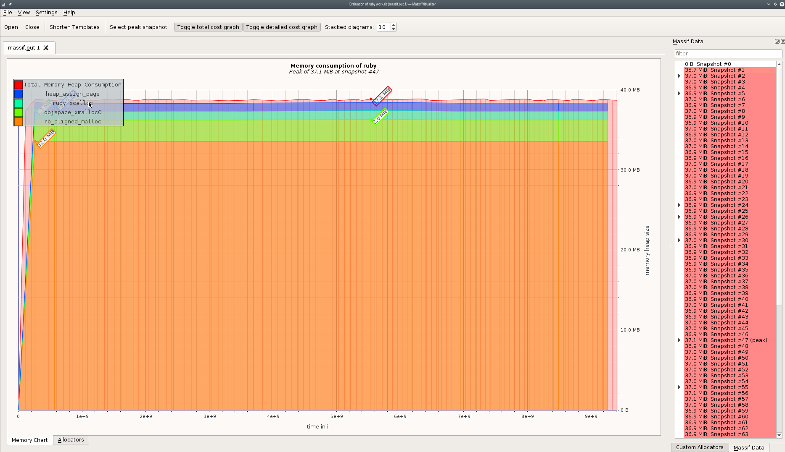

# Case-study оптимизации по памяти

## Актуальная проблема
Анализ работы программы после оптимизации алгоритма обработки данных по времени показал значительное потребеление памяти.
На файл размером 129 MB затрачивается примерно 2 GB при включенном GC и около 4GB при отключенном GC.

## Цель
Оптимизировать алгоритм обработки данных, так, что бы в результате использование памяти не привышало 70 MB.
## Задачи
- [X] Построить и проанализировать отчёт гемом `memory_profiler`
- [X] Построить и проанализировать отчёт `ruby-prof` в режиме `Flat`;
- [X] Построить и проанализировать отчёт `ruby-prof` в режиме `Graph`;
- [X] Построить и проанализировать отчёт `ruby-prof` в режиме `CallStack`;
- [X] Построить и проанализировать отчёт `ruby-prof` в режиме `CallTree` c визуализацией в `QCachegrind`;
- [X] Построить и проанализировать текстовый отчёт `stackprof`;
- [X] Построить и проанализировать отчёт `flamegraph` с помощью `stackprof` и визуализировать его в `speedscope.app`;
- [X] Построить график потребления памяти в `valgrind massif visualier` и включить скриншот в описание вашего `PR`;
- [X] проанализировать потребление памяти на файлах различного размера и GC enabled/disabled
- [X] Написать тест, на то что программа укладывается в бюджет по памяти
- на основе отчетов оптимизировать главные точки роста и уложиться в бюджет 70 MB

## Ход работы
Для работы был выбран превдарительно оптимизированный по времени выполнения алгоритм.
В процессе работы, после каждой итерации производился контроль качества вносимых изменений посредством выведения итогового потребления памяти
 ` puts "MEMORY USAGE: %d MB" % (ps -o rss= -p #{Process.pid}.to_i / 1024) Mb."` и анализа использования памяти по времени выполнения  
с помощью valgrind. Так же в процессе оптимизации по памяти, производился контроль времени работы. 

### находка №1
- Каждый из отчетов показал основные точки роста `split` и `Array::each`, 49% и 90% соответственно. Первым было решено исправить точку роста `split`
- переделав на потоковое чтение файла, не затрагивая остальной логики работы алгоритма.
- это привело к уменьшению потребления памяти до 680 MB и увеличению времени работы до 50 секунд при обработке файла из 3250940 строк

### находка №2
- вторая точка роста `Array::each` была исправлена переаботкой на потокую запись статистки.
- Однако сам алгоритм вормирования статистки был маскимально приближен к предидущей итерации для большей чистоты полученных результатов.
- в итоге потребление памяти уменьшилось до 38 MB и время работы составило приблизительно 40 секунд.
- Отчет valgrind сменился с линейного роста, на константу. В тоже самое время при выключенном GC отчет показал увеличение потребления памяти, до 5GB на файле размером 129 MB 

### находка №3
- дальнейшая оптимизация формирования статистки по пользователю, точка роста `Array::each`, посредством ручного формирования json поля, без формирования хэша и дальнейшего HACH-to_json пробразования
не показало никакого уменьшения потребления памяти, но привело к уменьшению времени работы алгоритма до 31 секунд

## Результаты
В результате проделанной оптимизации удалось добиться потребления памяти в рамках заложенного бюджета и незначительного роста времени выполния, снизив потребеление с 2GB до 38 MB , сохранить время выполнения в пределах 30+/-1,5 секунд

 

**Рис. 1** использование памяти в течении работы после оптимизвации

## Защита от регрессии производительности
Для защиты от потери достигнутого прогресса при дальнейших изменениях программы был написан простой тест на итоговое потребление памяти `expect(memory_usage_after - memory_usage_before).to be <= 70`.
Попытки использовать `expect { work('data_small.txt') }.to perform_allocation(73400320).bytes` приводили к непримелимо долгой работе теста даже на малых данных(не дождался завершения за разумное время)

