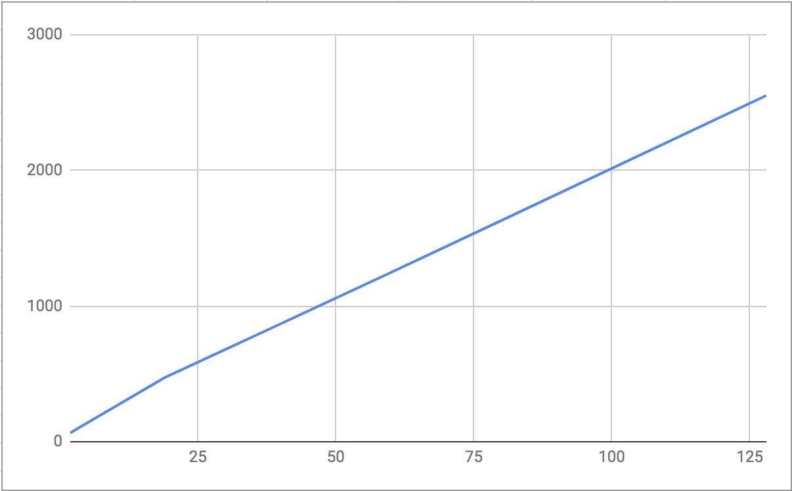
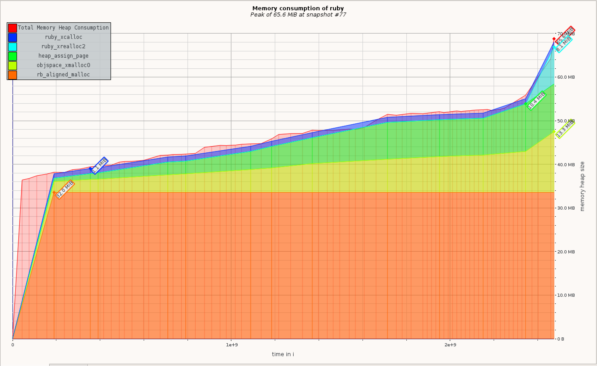
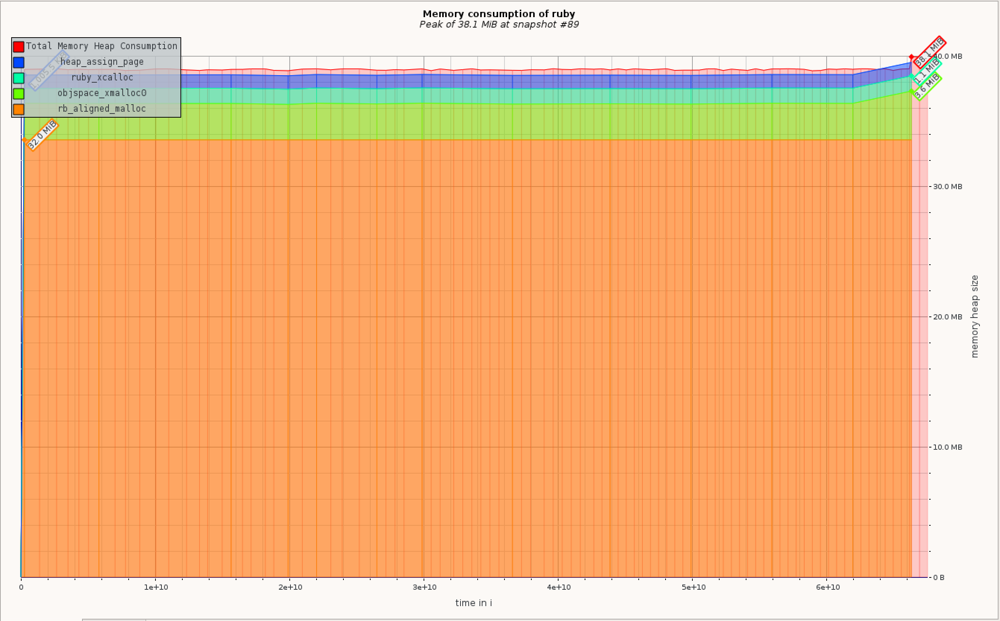

# Case-study оптимизации

## Актуальная проблема
В нашем проекте возникла серьёзная проблема.

Необходимо было обработать файл с данными, чуть больше ста мегабайт.

У нас уже была программа на `ruby`, которая умела делать нужную обработку.

Она успешно работала на файлах размером пару мегабайт, но для большого файла она потребляла слишком много памяти, что угрожало другим сервисам работающим на данной машине 
и кошельку кампании, вынужденной оплачивать дополнительные ресурсы.

Я решил исправить эту проблему, оптимизировав эту программу.

## Формирование метрики
Для того, чтобы понимать, дают ли мои изменения положительный эффект на потребление памяти программой я придумал использовать такую метрику: количество потребляемой памяти в процессе работы и на выходе программы для файла размером 100_000 строк. 

## Гарантия корректности работы оптимизированной программы
Программа поставлялась с тестом. Выполнение этого теста в фидбек-лупе позволяет не допустить изменения логики программы при оптимизации.

## Feedback-Loop
Для того, чтобы иметь возможность быстро проверять гипотезы я выстроил эффективный `feedback-loop`, который позволил мне получать обратную связь по эффективности сделанных изменений за ~10 секунд

Вот как я построил `feedback_loop`: подготовил файл, обработка которого выполняется достаточно быстро и написал несколько скриптов для генерации отчетов профилировщиков.

## Вникаем в детали системы, чтобы найти главные точки роста
Для того, чтобы найти "точки роста" для оптимизации я воспользовался:
- скриптом, который показывает количество памяти потребляемой процессом в конце выполнения работы
- профилировщиками ruby: memory_profiler (большую часть времени), ruby_prof и stackprof
- Valgrind Massif - heap профилировщик

Вот какие проблемы удалось найти и решить

### Находка №0
Для начала я решил проверить каким образом потребление памяти на выходе из программы зависит от размера входного файла
Для этого использовал команду `ps -o rss= -p`, которая дала следующие результаты

| Строк | Размер файла | Потребление памяти |
| --- | --- | --- |
| 50_000 | 1.9MB | 65MB |
| 100_000 | 3.8MB | 111MB |
| 500_000 | 19MB | 473MB |
| 1_000_000 | 39MB | 850MB |
| 1_500_000 | 59MB  | 1229MB |
| 2_000_000 | 79MB | 1612MB |
| 3_250_940 | 128MB | 2553MB |



Данная метрика показала линейный рост потребления памяти, но не помогла найти никаких точек роста.

### Находка №1
Во имя науки я прогнал программу через несколько профилировщиков - memory_profiler, ruby prof и stackprof и все они дружно показали на вызов метода `split`.  
```
Total allocated: 122.20 MB (1513067 objects)
Total retained:  0 B (0 objects)

allocated memory by location
-----------------------------------
  47.38 MB  ruby/rails-optimization-2-task2/task-2.rb:16 (split method call)
  19.62 MB  ruby/rails-optimization-2-task2/task-2.rb:59 (session object generation)
```
Этот метод разбивает исходную строку и создает подстроки которые предположительно живут все время выполнения программы поскольку из них формируются наборы более сложных обьектов.  
Я решил переписать программу таким образом, чтобы не формировать и не хранить сложные объекты на основе строк (user, session) - что даст возможность GC удалять обработанные строки из памяти.
  
Метрика изменилась в лучшую сторону, программа на выходе стала потреблять вдвое меньше памяти - ~52MB, memory_profiler также показал улучшение, но к сожалению показатели метода split не изменились
```
Total allocated: 98.84 MB (1466771 objects)
Total retained:  0 B (0 objects)

allocated memory by location
-----------------------------------
  47.38 MB  /Users/dn/Work/my/ruby/rails-optimization-2-task2/task-2.rb:16 (split method call)
   9.09 MB  /Users/dn/Work/my/ruby/rails-optimization-2-task2/task-2.rb:7  (read entire file to memory)
```

### Находка №2
Согласно отчетам memory_profiler второй по потреблению памяти точкой стала загрузка файла в память, а также я обратил внимание на количество одинаковых строк, создаваемых в процессе работы  
Решил читать файл построчно, а повторяющиеся строки вынести в константы  
Удалось уменьшить потребление памяти еще на ~27%  
```
Total allocated: 71.79 MB (982202 objects)
Total retained:  0 B (0 objects)

allocated memory by location
-----------------------------------
  36.74 MB  /Users/dn/Work/my/ruby/rails-optimization-2-task2/task-2.rb:26 (split method call)
   9.09 MB  /Users/dn/Work/my/ruby/rails-optimization-2-task2/task-2.rb:74 (Oj.dump)
```

### Находка №3
Построив отчет в Valgrind (massif) я обнаружил всплеск потребления памяти в конце выполнения программы, вероятно это генерация JSON. 
А также понял благодаря графику что потребление памяти неизбежно будет расти поскольку файл хоть и читается в память построчно, 
большая часть результатов этого чтения сохраняется в память и ждет генерации JSON.

Я решил сохранять промежуточные результаты работы в другой файл, а затем на его основе строить результирующий.
В результате удалось получить *для большого файла* результат по памяти на выходе программы ~20MB (`ps -o rss= -p`), а в процессе работы максимальный пик ~38MB (valgrind)


## Результаты
В результате проделанной оптимизации удалось обработать файл с данными без значительных затрат оперативной памяти.
Удалось улучшить метрику системы: изначально программа потребляла на выходе ~2538 MB памяти для файла размером 128 MB (3250940 строк), после оптимизации стала потреблять ~20MB
Количество потребляемой памяти перестало зависеть от размера входного файла.

### Какими ещё результами можете поделиться
Пришлось немного пожертвовать метриками в угоду читаемости кода  
Программа стала обрабатывать большой файл за 10-12 сек  

## Защита от регрессии производительности
Для защиты от потери достигнутого прогресса при дальнейших изменениях программы я добавил тест который замеряет количество памяти потребляемое на выходе из программы
