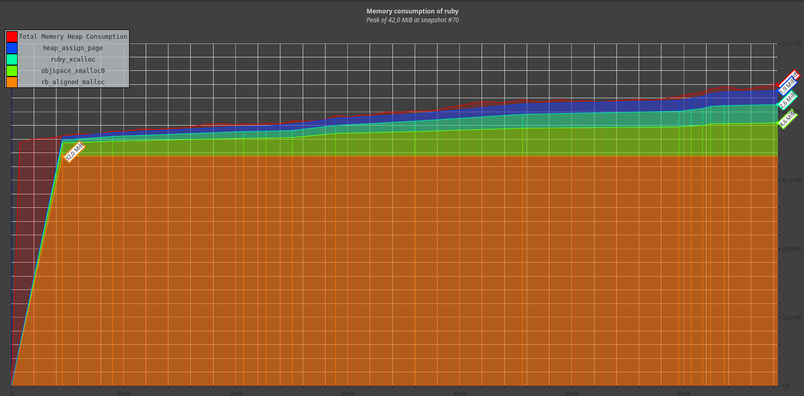

# Case-study оптимизации

## Актуальная проблема
В нашем проекте возникла серьёзная проблема.

Необходимо было обработать файл с данными, чуть больше ста мегабайт.

У нас уже была программа на `ruby`, которая умела делать нужную обработку.

Она успешно работала на файлах размером пару мегабайт, но для большого файла она работала слишком долго, 
и не было понятно, закончит ли она вообще работу за какое-то разумное время.

Я решил исправить эту проблему, оптимизировав эту программу.

## Формирование метрики
Для того, чтобы понимать, дают ли мои изменения положительный эффект на быстродействие программы я придумал 
использовать такую метрику: 
 Обработка 1 мегабайтного входного файла не должна превышать 32 мегабайт памяти.
 Обработка 10 мегабайтного входного файла не должна превышать 35 мегабайт памяти.
 Обработка 100 мегабайтного входного файла не должна превышать 66 мегабайт памяти.

## Гарантия корректности работы оптимизированной программы
Программа поставлялась с тестом. Выполнение этого теста в фидбек-лупе позволяет не допустить изменения логики 
программы при оптимизации.

## Feedback-Loop
Для того, чтобы иметь возможность быстро проверять гипотезы я выстроил эффективный `feedback-loop`, 
который позволил мне получать обратную связь по эффективности сделанных изменений за *время, которое у вас получилось*

Вот как я построил `feedback_loop`:

## Вникаем в детали системы, чтобы найти главные точки роста
Для того, чтобы найти "точки роста" для оптимизации я воспользовался:
  - benchmark
  - memory_profiler
  - ruby-prof в режиме Flat;
  - ruby-prof в режиме Graph;
  - ruby-prof в режиме CallStack;
  - ruby-prof в режиме CallTree c визуализацией в QCachegrind;
  - stackprof;
  - flamegraph и визуализация его в speedscope.appс помощью stackprof ;
  - valgrind massif visualier

Вот какие проблемы удалось найти и решить

### Находка №1
  Применив benchmark выяснилось что: 
    - 10_000 строк (387 Kb) занимают 19-20 мб и выполняется за 0,14 секунд
    - 100_000 строк (4 Mb) занимают 19-20 мб и выполняется за 1,2 секунды
    - На полном объеме данных (134.4 Mb) занимат 19-20 мб и выполняется за 60 секунд

### Находка №2
  Применив benchmark проверил статистику по GC за время выполнения программы. 
    - Минимальное количество запусков GC - 24
    - Максимальное количество запусков GC - 193
    - heap_live_slots увеличилось с 38189 до 47096
    - heap_free_slots уменьшилось с 13981 до 5074
    - total_allocated_objects увеличилось с 185494 до 3143953
    - malloc_increase_bytes увеличилсось с 245360 до 116744
    - minor_gc_count увеличился с 19 до 188
    - Изменение статистики количества объектов:
      На начало выполнения - { :TOTAL=>52170, :FREE=>14575, :T_OBJECT=>1499, :T_STRING=>17797, :T_REGEXP=>431, 
                                :T_ARRAY=>3702, :T_HASH=>328, :T_FILE=>11, :T_DATA=>784, :T_MATCH=>4, :T_IMEMO=>11559}
      После выполнения - {:TOTAL=>52170, :FREE=>5518, :T_OBJECT=>1515, :T_STRING=>24722, :T_REGEXP=>317, 
                            :T_ARRAY=>5340, :T_HASH=>943, :T_FILE=>64, :T_DATA=>936, :T_MATCH=>102, :T_IMEMO=>11233}
  В целом очевидно, что приложение расходует память. 
  
### Находка №3
  Применив memory_profiler обнаружил, что для файла в 100_000 строк  
    - allocated memory by file: 338 Mb
    - Главная точка роста 170 Mb находится в строке
        File.write('result.json', "\"#{user_attr['first_name']} #{user_attr['last_name']}\":#{report.to_json},", mode: 'a')
  Оптимизация:
    - Запись в файл происходила в каждой итерации сбора информации о пользователе. 
    - Перенес открытие файла в начало программы file = File.open('result.json', 'w')
    - В программе использовал переменную file для записи данных. 
  Изменения отчета. 
    - allocated memory by file: 195.10 MB
    - Точка роста устранена.
    
### Находка №4
  Применив memory_profiler обнаружил, что для файла в 100_000 строк  
    - allocated memory by file: 195.10 Mb
    - Главная точка роста 40.59 MB находится в строке
        fields = session.split(',')
  Оптимизация:
    - Данный split не требудется, т.к. строка разбивается выше по вызову этого метода.  
    - Передаю в метод parse_session сразу массив строк.   
  Изменения отчета. 
    - allocated memory by file: 147.72 MB
    - Точка роста устранена.
    
### Находка №5
  Применив memory_profiler обнаружил, что для файла в 100_000 строк  
    - allocated memory by file: 147.72 Mb
    - Главная точка роста строка "session". Создана 184569.
  Оптимизация:
    - Добавил "# frozen_string_literal: true" в начало программы. 
  Изменения отчета. 
    - allocated memory by file: 133.87 MB
    - Точка роста уменьшилась с 184569 экземпляров до 84569
    
### Находка №6
  Применив stackprof обнаружил, что для файла в 100_000 строк  
    18.6% аллокации занимает выполнение строки 
      file.write("\"#{user_attr['first_name']} #{user_attr['last_name']}\":#{report.to_json},")
  Оптимизация:
    - Заменил использование в хэше парсинга строк на символы 
    - Заменил парсинг данных пользователя и сразу пишу в хэш полное имя. 
        def parse_user(fields)
          {
            full_name: "#{fields[2]} #{fields[3]}",
          }
        end
    - Заменил гем json на Oj
  Изменения отчета.
    1.0% аллокации занимает выполнение file.write("\"#{user_attr[:full_name]}\":")
    1.3% аллокации занимает выполнение file.write("#{Oj.dump(report)},")
    Точка роста была уменьшена  
    
### Находка №7
  Применив stackprof обнаружил, что для файла в 100_000 строк  
    9.7% аллокации занимает выполнение строки 
      user_sessions = user_sessions + [session_attr]
  Оптимизация:
    - Заменил сложение массивов на push элемента в массив. 
      user_sessions << session_attr
  Изменения отчета.
    Точка роста устранена
    
### Находка №8
  Применив stackprof обнаружил, что для файла в 100_000 строк  
    10.1% аллокации занимает выполнение строки 
      unique_browsers += [browser]
  Оптимизация:
    - Заменил сложение массивов на push элемента в массив. 
      unique_browsers << browser
  Изменения отчета.
    Точка роста устранена
 
### Находка №9
  Применив ruby-prof обнаружил, что для файла в 100_000 строк  
    28.3% памяти занимает выполнение parse_session
  Оптимизация:
    - Заменил browser: "fields[3].upcase" на "browser: fields[3].upcase!" 
    - Разобрал и отказался от использования метода parse_session. Этот метод только создавал лишний хэш
    - Благодаря чему получилось избавиться от использования лишних массивов и операций с ними
  Изменения отчета.
    Точка роста устранена
    
### Находка №10
  Применив ruby-prof обнаружил, что для файла в 100_000 строк  
    8.2% памяти занимает выполнение parse_user
  Оптимизация: 
    - Разобрал и отказался от использования метода parse_user. Этот метод только создавал лишний хэш
    - Благодаря чему получилось избавиться от использования лишних массивов и операций с ними
  Изменения отчета.
    Точка роста устранена
    
### Находка №10
  Применив ruby-prof обнаружил, что для файла в 100_000 строк  
    4920 объектов (51,9% аллокации) занимает выполнение split строки
  Оптимизация: 
    - Переделал на итерацию по символам
  Изменения отчета.
    Работа со строками уменьшилась до 1191 объекта. 
    Точка роста уменьшена
    

## Результаты
В результате проделанной оптимизации удалось обработать файл с данными.
Удалось улучшить метрику системы с 
    Использование памяти до запуска программы: 19 MB
    Время выполнени 63.569528591 секунды
    Использование памяти после выполнения программы: 20 MB

На метрику 
    Использование памяти до запуска программы: 20 MB
    Время выполнени 4.856727282 секунды
    Использование памяти после выполнения программы: 20 MB
    
В бюджет, указанный в домашнем задании уложился. 

Но разные профилировщики показывают разное количество используемой памяти. Хотя с другой стороны никакой из них так 
и не вышел за бюджет.

## Защита от регрессии производительности
Для защиты от потери достигнутого прогресса при дальнейших изменениях программы был написан тест в котором выставлены 
ограничения на использование памяти. 
