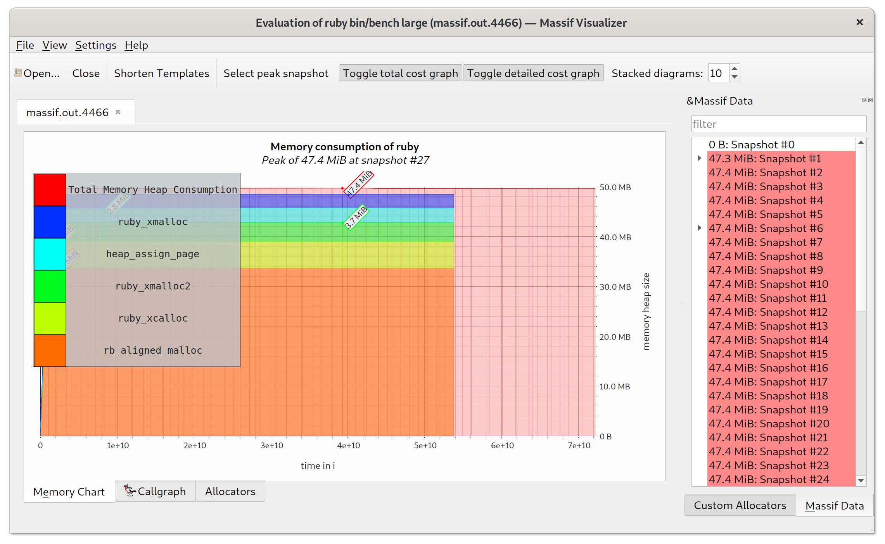

# Case-study оптимизации

## Актуальная проблема
В нашем проекте возникла серьёзная проблема.

Необходимо было обработать файл с данными, чуть больше ста мегабайт.

У нас уже была программа на `ruby`, которая умела делать нужную обработку.

Она успешно работала на файлах размером пару мегабайт, но для большого файла она работала слишком долго, и не было понятно, закончит ли она вообще работу за какое-то разумное время.

Я решил исправить эту проблему, оптимизировав эту программу.

## Формирование метрики
Для того, чтобы понимать, дают ли мои изменения положительный эффект на быстродействие программы, я придумал
использовать такую метрику: объём потребляемой процессом Ruby памяти после выполнения программы.

## Беглый анализ асимптотики

Я не стал использовать подход, который я использовал при выполнении
[задания №1](https://github.com/hardcode-dev/rails-optimization-task1/pull/60), а именно я не стал нарезать
выборки "на лету" при выполнении скриптов замера производительности/памяти и профилировании, т.к. это скорее
всего внесло бы изменения в потреблении памяти программой, что сделало бы оценку неточной. Вместо этого я
решил нарезать файлы для выборок разных размеров заранее с помощью скрипта `bin/setup`, который подготовил
выборки размерами 2500, 5000, 10000, 20000, 25000, 50000 и 100000 строк. Для этих же выборок я выполнил начальный
замер нашей метрики:

``` sh
$ for sample_size in 2500 5000 10000 20000 25000 50000 100000; do bin/bench $sample_size; done
```

Полученные результаты отражены в следующей таблице:

| Размер выборки | Потребляемая память, MB | Время выполнения, сек. |
|----------------|-------------------------|------------------------|
| 2500           | 41                      | 0.0874                 |
| 5000           | 63                      | 0.3099                 |
| 10000          | 98                      | 1.0644                 |
| 20000          | 135                     | 4.3705                 |
| 25000          | 162                     | 7.1858                 |
| 50000          | 254                     | 40.7473                |
| 100000         | 341                     | 169.2121               |

Из этих данных я делаю вывод, что потребляемая память зависит линейно от размера выборки. А это значит, что
на обработку исходного файла потребуется примерно 11 GB памяти:

``` sh
$ ruby -e 'puts (341 * 3250940.0 / 100000).round'
11086
```

При дальнейшей оптимизации я буду использовать размер выборки 20000, т.к. обработка такого файла выполняется
относительно быстро.

## Гарантия корректности работы оптимизированной программы
Программа поставлялась с тестом. Выполнение этого теста в фидбек-лупе позволяет не допустить изменения логики
программы при оптимизации.

## Feedback-Loop
Для того, чтобы иметь возможность быстро проверять гипотезы я выстроил эффективный `feedback-loop`,
который позволил мне получать обратную связь по эффективности сделанных изменений за 5-10 секунд.

Вот как я построил feedback-loop:

1. профилирую скрипт, чтобы выявить "точки роста"
2. вношу изменения в скрипт;
3. запускаю регрессионный тест, чтобы убедиться, что изменения не поломали код;
4. запускаю бенчмарк;
5. анализирую результаты;
6. коммит или возврат изменений.

Пункты 3-4 реализованы в скрипте bin/feedback.

## Вникаем в детали системы, чтобы найти главные точки роста
Для того, чтобы найти "точки роста" для оптимизации я воспользовался следующими инструментами:

- ruby-prof (`bin/ruby-prof`);
- stackprof (`bin/stack-prof`);
- memory profiler (`bin/memory-profiler`);
- valgrind + massif + massif visualizer.

Вот какие проблемы удалось найти и решить

### Находка №1: потоковая обработка данных

- Согласно условию задачи надо переписать скрипт таким образом, чтобы он использовал потоковую обработку данных.
- Т.к. теперь по условию задачи гарантируется, что сессии пользователя в файле идут одним куском сразу после самого
   пользователя, то я переписал обработку следующим образом. Теперь мы читаем файл построчно и сохраняем информацию
   о пользователе и его сессияи хранится в переменной `last_user_stats`. Сначала читается строка, которая относится
   к пользователю, затем читаются его сессии, которые агрегируются в `last_user_stats`. Когда сессии текущего
   пользователя заканчиваются, мы выводим его в файл и переходим к парсингу следующего пользователя. Общая же
   информация о пользователях и сессиях агрегируется в объекте `summary`.
- Значение метрики для 20000 строк снизилось с 135 MB до 25 MB. Для интереса я решил попробовал прогнать скрипт на
   выборках большего размера (в том числе и `large`), и понял, что перестарался: скрипт начал выполняться в
   константном объеме памяти 25-26 MB на выборках любого размера (26 MB / 20 секунд на `large`, т.е. в бюджет
   мы уже попали).
- Теперь скрипт переписан на потоковую обработку данных, дальше я занялся профилированием.

### Находка №2: ненужный парсинг дат
- Я воспользовался `ruby-prof` с отчётом `callgrind` (смотрел в `kcachegrind`) и выявил главную точку роста:
   `Date.parse` с 22% self и ~17000 вызовов. Другие отчёты, а также `stack-prof`, показали такую же картину.
- Как и в прошлой задаче, я избавился от парсинга дат и просто отсортировал их строковое представление (т.к.
   даты для формата ISO8601 результат лексикографической сортировки совпадает с результатом "временной").
- По результатам `bin/bench` потребление памяти не изменилось (однако memory profiler показал, что Total allocated
  снизилось с 40.85 MB (581142 objects) до 17.19 MB (283770 objects)).
- В профилировщике метод `Date.parse` перестал быть точкой роста, поэтому я решил оставить данное изменение.

### Находка №3: строковые литералы не зафрижены
- Дальше я запустил memory profiler и увидел, что больше всего аллокаций (32187, или 11.09 MB) приходится на
   строки; кроме того, в Allocated String Report видно, что на строковые литералы приходится большое количество
   аллокаций. Например, строка "INTERNET EXPLORER" создавалась 8845 раз.
- Зафризил строковые литералы с помощью комментария `frozen_string_literal`.
- По результатам `bin/bench` потребление памяти не изменилось (однако memory profiler показал, что Total allocated
  снизилось с 17.19 MB (283770 objects) до 13.69 MB (196156 objects).
- В отчёте memory profiler число строковых аллокаций осталось наибольшим, но при этом снизилось до 158482 аллокаций,
   или 7.59 MB, поэтому я решил оставить данное изменение.

### Находка №4: аллокации в `String#split`

- Я снова запустил memory profiler посмотрел, какая строка в скрипте выделяет больше всего памяти. Это оказалось
   строка `line.split(',')` с 8.68 MB.
- В `String#split` можно передать опциональный блок, который будет вызываться для каждой полученной подстроки.
   Однако, чтобы можно было его использовать, пришлось написать небольшой конечный автомат.
- По результатам `bin/bench` потребление памяти не изменилось (однако memory profiler показал, что Total allocated
   снизилось с 13.69 MB (196156 objects) до 9.69 MB (176156 objects).
- В отчёте memory profiler для строки `line.split` объём выделенной памяти снизился до 4.68 MB, при этом данная
   строка осталась на первом месте по аллокациям, поэтому я оставил данное изменение.

## Результаты
В результате проделанной оптимизации наконец удалось обработать файл с данными.

Удалось улучшить метрику системы для размера выборки 20000 с 135 MB до 25 MB, а для `large` файла - до 25 MB. При
этом обработка `large`-файла теперь занимает всего 7.6678 секунд (т.е. за счёт оптимизации памяти удалось добиться
почти трехкратного прироста производительностив по сравнению с 19.5225 секундами, полученнымими в результате
выполнения первого ДЗ).

При этом мы перешли от линейной зависимости занимаемой Ruby-процессом памяти от размера выборки к константному.
Меня немного смущает, что после находки №1 объем используемой памяти, измеряемый скриптом `bin/bench`, больше не
менялся, хотя memory profiler постоянно сообщал о снижении потреблении памяти. Я могу предположить, что это
связано с фрагментацией памяти.

В процессе оптимизации (находка №4) для улучшения производительности мне пришлось написать неидиоматический,
очень плохо читаемый код. Для сравнения, было:

``` rb
    cols = line.split(',')

    case cols[0]
    when 'user'
      if last_user_stats
        last_user_stats.dump(out)
      else
        last_user_stats = UserStats.new
      end

      last_user_stats.full_name = cols[2] + ' ' + cols[3]

      summary.on_user
    when 'session'
      browser = cols[3]
      time = cols[4].to_i
      date = cols[5]

      browser.upcase!

      last_user_stats.on_session(browser, time, date)
      summary.on_session(browser)
    end
```

Стало:

``` rb
    column_index = 0

    type = nil
    first_name = nil
    browser = nil
    time = nil
    date = nil

    line.split(',') do |column|
      case type
      when 'user'
        case column_index
        when 1
          summary.on_user

          if last_user_stats
            last_user_stats.dump(out)
          else
            last_user_stats = UserStats.new
          end
        when 2 then first_name = column
        when 3 then last_user_stats.full_name = first_name + ' ' + column
        end

      when 'session'
        case column_index
        when 3 then browser = column
        when 4 then time = column.to_i
        when 5 then
          browser.upcase!

          last_user_stats.on_session(browser, time, column)
          summary.on_session(browser)
        end
      else
        type = column
      end

      column_index += 1
    end
```

В реальной жизни я бы такой код ради 4 MB скорее всего писать не стал.

Далее я проанализировал выполнение скрипта для `large`-данных с помощью Valgrind & Massif & Massif Visualizer,
которые показали пиковое потребление памяти в 47 MB:



(почему-то valgrind не создавал файл massif, если вызывать скрипт как `bin/bench large`, но работал, если явно
вызывать его как `ruby bin/bench large`).

## Защита от регрессии производительности


Для защиты от потери достигнутого прогресса при дальнейших изменениях программы я написал performance-тест,
который можно вызвать следующим образом:

``` sh
$ bundle exec rspec --tag @benchmark
```
