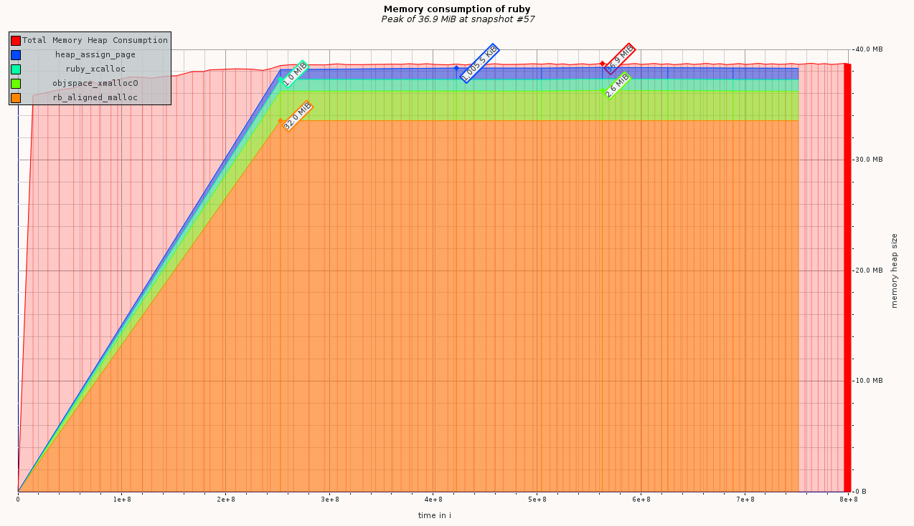

# Case-study оптимизации

## Актуальная проблема

Необходимо обработать файл с данными, чуть больше ста мегабайт.

У нас уже была программа на `ruby`, которая умела делать нужную обработку.

Она успешно работала на файлах размером пару мегабайт, но для большого файла она требует слишком большого объема памяти.

Была поставлена задача, чтобы за все время обработки рабочего файла программа не занимала более 70 мегабайт оперативной памяти.

# Анализ задачи

Исходный файл имеет размер 130 мегабайт, что уже больше бюджета, а значит чтение и анализ файла надо проводить построчно.
  
## Формирование метрики
Для анализа влияния изменений кода на используемую память будем размер занимаемой памяти в конце задачи. 

В начала работы использую такую метрику - обработка 20 000 строк занимает 82 Мб памяти.

## Гарантия корректности работы оптимизированной программы
Программа поставлялась с тестом. Выполнение этого теста в фидбек-лупе позволяет не допустить изменения логики программы при оптимизации.

## Feedback-Loop
Для того, чтобы иметь возможность быстро проверять гипотезы я выстроил эффективный `feedback-loop`, который позволил мне получать обратную связь по эффективности сделанных изменений за 10-20 секунд

1. Для получения обратной связи я пользуюсь командой которая проверяет корректность работы, потом замеряет метрику
1. После чего я запускаю профайлер(ы) и по отчетам анализирую изменения
 
## Вникаем в детали системы, чтобы найти главные точки роста

Для того, чтобы найти "точки роста" для оптимизации я воспользовался
- гемом memory_profiler

Вот какие проблемы удалось найти и решить

### Находка №1
- memory_profiler показал, что самую большую часть памяти среди объектов занимают массивы 
- решено отказаться от сбора данных в массивы, а обрабатывать и записывать отчет по каждому пользователю
- метрика уменьшилась до 15 мегабайт
- как изменился отчёт профилировщика теперь массивы занимают 13.36 MB

### Изменение метрики
 Замеряю использованную память при обработке 200_000 строк - 15 MB
 Замеряю использованную память при обработке 1_500_000 строк - 17 MB
 Замеряю использованную память при обработке всего рабочего файла - 17 MB
 
## Результаты
В результате проделанной оптимизации удалось обработать файл с данными.
Грубое измерение метрики показывает, что программа укладывается в бюджет.

Удалось улучшить метрику системы и уложиться в заданный бюджет.

*Какими ещё результами можете поделиться*

## Защита от регрессии производительности

Для защиты от потери достигнутого прогресса при дальнейших изменениях программы был написан тест с фиксацией размера потребляемой памяти при обработки файла с 500 тысячами строк. 

## Checklist
- [+] Построить и проанализировать отчёт гемом `memory_profiler`
- [+] Построить и проанализировать отчёт `ruby-prof` в режиме `Flat`;
**не нагляден**

- [+] Построить и проанализировать отчёт `ruby-prof` в режиме `Graph`;
**удобен, но надо разносить код в именованые методы**

- [+] Построить и проанализировать отчёт `ruby-prof` в режиме `CallStack`;
**очень удобное представление, но надо разносить код в именованые методы**

- [+] Построить и проанализировать отчёт `ruby-prof` в режиме `CallTree` c визуализацией в `QCachegrind`;
**В убунту не нашел QCachegrind, есть kcachegrind, там нет отображения в виде блок-схемы**

- [+] Построить и проанализировать текстовый отчёт `stackprof` для рабочего файла

 При попытке получить данные по методу "Oh My ZSH!" воспринимает опцию --method Object#work как какую-то команду для себя. Надо писать --method "Object#work" 
 
 **Не наглядно**
 - [-] Построить и проанализировать отчёт `flamegraph` с помощью `stackprof` и визуализировать его в `speedscope.app`;
**Не понял как**

- [+] Построить график потребления памяти в `valgrind massif visualier` и включить скриншот в описание вашего `PR`;

# Что еще можно сделать

### Находка №2
- По опыту известно, что библиотека json исолпьзует довольно много памяти
- форматировать вывод самостоятельно
- для ускорения feedback-loop взята метрика: память для обработки 1_500_000 записей, она составляет 17700 - 18000 килобайт
- Метрика значимо не изменилась

### Находка №3
- отчет MemoryProfiler показывает, что очень много раз выделяются одинаковые строки
- использовать константы
- Метрика значимо не изменилась
- использование памяти с выключенным GC снизилось с 98 до 90 мб.

### Находка №4
- отчет MemoryProfiler показывает, что все еще много раз выделюятся одинаковые строки при определение типа записи в исходном файле и разбиении их
- оптимизировать эти строки
- Метрика снизилась до 16900-17100 кб
- использование памяти с выключенным GC снизилось с 90 до 86 мб. 
- ** читаемость кода снизилась**

### Находка №5
- отчет MemoryProfiler показывает, что строка "result.json" выделяется столько раз, сколько происходит записаь в файл, несмотря на использование константы 
- один раз открыть файл для записи
- Метрика значимо не изменилась
- использование памяти с выключенным GC снизилось с до 78 мб.

Отчет MemoryProfiler не показывает избыточного выделения памяти.  

 

