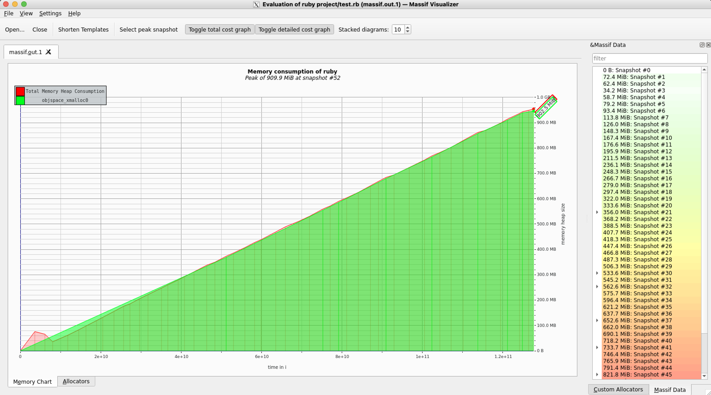
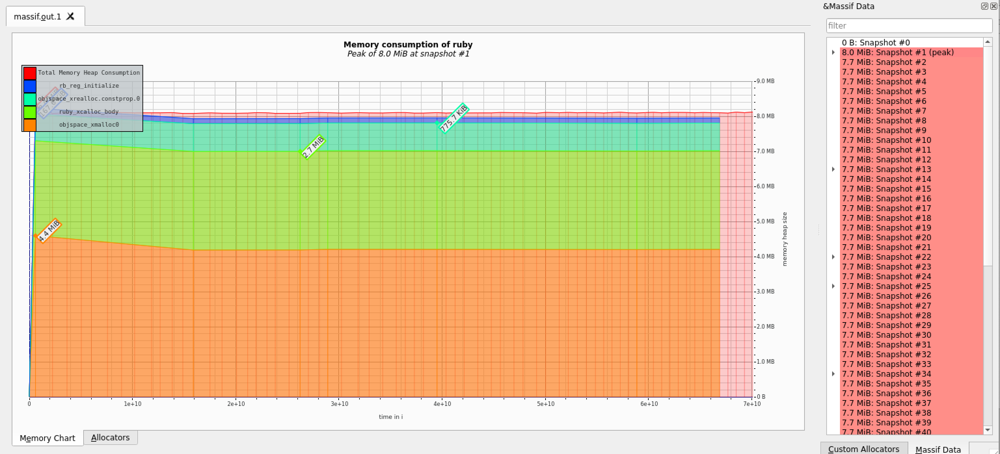

# Case-study оптимизации

## Актуальная проблема
В нашем проекте возникла серьёзная проблема.

Необходимо было обработать файл с данными, чуть больше ста мегабайт.

У нас уже была программа на `ruby`, которая умела делать нужную обработку.

Она успешно работала на файлах размером пару мегабайт, но для большого файла она работала слишком долго, и не было понятно, закончит ли она вообще работу за какое-то разумное время.

Я решил исправить эту проблему, оптимизировав эту программу.

## Формирование метрики
Для того, чтобы понимать, дают ли мои изменения положительный эффект на быстродействие программы, была поставлена задача использовать такую метрику: "Потребление оперативной памяти"

Чтобы понимать, на какой бюджет мы можем расчитывать, для начала хотелось бы оценить, какой бюджет мы имеем в данный момент. Для этого я несколькими способами решил оценить текущие требования по памяти

### Способ 1: ps -o rss


На разных объемах данных я погонял тесты и попросил по результатам выполнения вывести мне данные, доступные из утилиты ps
```ruby
"MEMORY USAGE: %d MB" % (`ps -o rss= -p #{Process.pid}`.to_i / 1024)
```
Получив следующие значения, я сделал вывод, что с ростом количества строк будет расти и потребление оперативной памяти, в соотношении примерно 3^N, где N- разница в порядке количества строк (при увеличении количества строк в 10 раз потребление памяти растет примерно в 3 раза).

1_000 lines => 37Mb
10_000 lines => 92Mb
100_000 lines => 250Mb

Результат очень приблизительный, однако задачи оценить точный бюджет у нас нет. Если допустить, что рассчеты произведены верно, то на 3.5M строках данных затраты по памяти должны составить 1-1.5 GB. Жирно.

Видим, что количество памяти, используемое на 1000 строчках кода равняется 37 MB- попробуем уложиться в этот результат * 1.5, т.е. в 50 MB.

### Способ 2: Valgrind

Заводим Docker, Valgrind, кофемашину и запускаем программу на 30к строках данных



Видим линейный рост памяти O(N), понимаем, что так мы не уложимся ни в какие бюджеты. Хотим сделать постоянный расход памяти O(1).

Из интересного: Valgrind показывает рост памяти почти до 1GB, в то время как обычный ps-o-rss показывает нам 251MB. Предоложу, что оверхед связан с запуском самого валгринда, но не уверен.

## Гарантия корректности работы оптимизированной программы
Программа поставлялась с тестом. Выполнение этого теста в фидбек-лупе позволяет не допустить изменения логики программы при оптимизации.
Перепишем этот тест с использованием библиотеки ~~Cucumber~~ Rspec


## Feedback-Loop
Для того, чтобы иметь возможность быстро проверять гипотезы я выстроил эффективный `feedback-loop`, который позволил мне получать обратную связь по эффективности сделанных изменений за *время, которое у вас получилось*

Вот как я построил `feedback_loop`:
В первую очередь я внес изменения в интерфейс самой программы, позволив передавать ей имя файла, с которым она будет работать.
Дальше я переключил проверку результатов из сравнения строк в сравнение json объектов.
Так же я подключил библиотеку rspec-benchmark и использовал #perform_allocation matcher чтобы зафиксировать текущие метрики потребления памяти.

Так же добавим тест по памяти
```ruby
context 'works on 1_000 lines within 70 MB' do
  let(:size) { 1_000 }

  it {
    prepare_data(size) do |filename|
      expect {
        work(filename)
      }.to perform_allocation(70 * 1024 * 1024).bytes
    end
  }
end
```
Опять же, интересный момент, что ps-o-rss показывает нам расходы в 50MB, в то время как тест дешевле, чем за 70MB не проходит. Спишем оверхед, опять же, на инфраструктурные расходы
На выходе получаем feedback-loop в 15 секунд, можно и побыстрее, если уменьшить количество строк кода, но в целом ожидаю, что после перевода на потоковый подход работать станет итак сильно быстрее

Так же добавим скриптик ./generate.sh и поправим ./test.rb, чтобы запускать программу на разных сетах данных было просто
```bash
./test.rb $(./generate 100)
```

## Вникаем в детали системы, чтобы найти главные точки роста

Внимательно изучив содержимое файла с данными, я обнаружил интересную закономерность: все пользователи идут по порядку и все данные о сессиях пользователя идут следом за строкой с информацией о пользователе.
Таким образом, если предположить, что информация и в дальнейшем будет поставляться в таком формате- я действительно могу переключиться в полностью потоковый режим. Если бы такое предположение было бы ошибочно и данные в файле шли вперемешку, пришлось бы придумывать что-то другое, как вынос результатов по каждому пользователю в отдельный файл или хранение большего объема промежуточных данных в оперативной памяти, или систему индексов для поиска данных пользователя в общем файле.

Для того, чтобы найти "точки роста" для оптимизации я воспользовался:
gem 'memory_profiler'
gem 'stackprof'
gem 'ruby-prof'

Вот какие проблемы удалось найти и решить

### Ваша находка №1 MemoryProfiler
Запустив MemoryProfiler на разных объемах данных, я вижу несколько проблемных мест. Интересный момент, что чем больше выборка данных- тем меньшую долю памяти занимает Date.parse (топ1 на 100 строчках, топ3 на 1000, топ5 на 10_000)
Самое узкое место, которое вижу- это сбор сессий. По сути мы загружаем `grep 'session' data_large.txt | wc -l` 2750940 строк в память, чтобы потом с ними работать.
Так же в отчете вижу данные по allocated strings и вижу, что это самый частовыделяемый объект в скрипте. Пожалуй, проведу быстрый эксперимент и включу #frozen_string_literal: true, чтобы проверить, какой эффект он привнесет
410MB против 417MB на нескольких запусках. Сомнительно, но оукэй


### Ваша находка №1.1 StackProf
Поскольку сразу после перехода на потоковый режим я ожидаю резкий рост производительности, я пожалуй, еще немного поковыряюсь с остальными профилировщиками
```
$ stackprof stackprof_reports/stackprof.dump
==================================
  Mode: object(1)
  Samples: 412728 (0.00% miss rate)
  GC: 0 (0.00%)
==================================
     TOTAL    (pct)     SAMPLES    (pct)     FRAME
    146929  (35.6%)      146929  (35.6%)     String#split
     93122  (22.6%)       76194  (18.5%)     Date.parse
    219184  (53.1%)       46091  (11.2%)     Object#collect_stats_from_users
    412720 (100.0%)       38939   (9.4%)     Object#work
     23399   (5.7%)       23399   (5.7%)     String#upcase
     16928   (4.1%)       16928   (4.1%)     Regexp#match
```
Вижу, что много памяти выделяется в методе String#split (разбивка файла по строкам, разбивка строк на атрибуты) и Date.parse. Но, как мы уже выяснили из MemoryProfiler, Date.parse довольно часто освобождается через GC и в принципе склонности к утечке памяти не имеет


### Ваша находка №1.2 RubyProf

RubyProf хуже справился с генерацией png графа (или что-то я сделал не так)
Так же из отчетов graph и callstack вижу проблемные места- String#split и Date#parse


Попробуем уже на этом этапе сделать инкремент и QCacheGrind используем уже следующим шагом, тем более, что данных для оценки мы уже собрали достаточно

После небольшого рефакторинга вижу, что тест на 1000 строчек у меня проходит по perform_allocations в 3МБ, хотя ps-o-rss по-прежнему пишет 30-40MB. Вот тут уже начинаются вопросики.
Добавим вывод памяти в начало метода Object#work и увидим, что 33MB выделяется еще до запуска самого тестируемого кода. Тогда получаем разницу на 1000 строк кода: 43 - 39 = 4MB, что вполне похожи на значения нашего тестового матчера

### Ваша находка 2
В нашем файле для запуска профилировщиков скопилось много ~~кавалерии~~. Что я могу сказать?


Раскомментируем все профилировщики и посмотрим сразу на все отчеты.

Уже по memory_profiler вижу уменьшение количества памяти с 410MB до 25MB
Посмотрим, что будет, если увеличить объем данных в 10 раз до 100_000 строк
```
Before:
Total allocated: 439.77 MB (412674 objects)

After:
Total allocated: 25.97 MB (363861 objects)

After on 10_000 lines:
Total allocated: 259.61 MB (3640038 objects)
```
Отлично, видим, что еще есть куда оптимизировать

Видим, что теперь самым жирным местом в плане выделения памяти стал парсинг даты и сплиты по строчкам. Оптимизируем количество сплитов и уберем двойной парсинг даты
```
After "split" optimization
Total allocated: 216.22 MB (2955469 objects)

After remove spare Date.parse
Total allocated: 143.42 MB (1909765 objects)
```

По данным Stackprof, по-прежнему самым жирным местом является String#split, но без него мы уже вряд ли сможем обойтись.

### Ваша находка 3

~~Запустим QCacheGrind
Ничего я тут не нашел, показывает на Array#split, на String#upcase, но что с этим конкретно делать- не могу придумать. Вернусь к RubyProf
В отчете callstack вижу большое количество обращений к String#upcase. Скорее всего речь идет о переводе имен браузеров к верхнему регистру. Попробуем оптимизировать, переместив этот метод в Object#parse_session~~


Кароч, проблема в том, что потребление памяти во время выполнения программы растет, потому что мы все-таки копим объект report, чтобы потом записать его в result.json.
Переделал еще раз на поточных подход, когда мы пишем в result.json прямо в процессе выполнения
```
После перехода на поточных подход
Total allocated: 128.08 MB (1646603 objects)
```



## Результаты
В результате проделанной оптимизации наконец удалось обработать файл с данными.
Удалось улучшить метрику системы с примерно 1-1.5 GB до 13MB и уложиться в заданный бюджет.
Если честно, я в итоге так и не понял, в какой бюджет я уложился. Valgrind показывает 8MB, тесты показывают 13MB, ps-o-rss показывает разницу между началом и концом исполнения программы в 2MB, MemoryProfiler говорит про выделение аж 128MB. Поэтому вот вопрос на самом деле, меня бы вполне устроил линейный рост памяти, если бы программа на 3.5М строках данных укладывалась в 70MB. Но из-за разницы в показаниях счетчиков, я пропустил момент, где можно было остановиться и все-таки сделал неприятную оптимизацию в "ручной" генерацией JSON.

Проведу мысленный эксперимент. В файле- 500к пользователей. По ТЗ надо было уложиться в объем 70МБ. Получаем 146 байт на пользователя. Там только строки с браузерами идут по 100+ символов. Получается, уложиться в заданный бюджет без сброса промежуточных результатов в файл- нельзя

## Защита от регрессии производительности
Для защиты от потери достигнутого прогресса при дальнейших изменениях программы защитил их обновленным тестом по производительности. Единственное чего не хватает- проверки асимптотики, однако вручную убедился, что на 1_000, 2_000 и 10_000 показатели по памяти одинаковые

```ruby
context 'works on 1_000 lines within 13 MB' do
  let(:size) { 1_000 }

  it {
    prepare_data(size) do |filename|
      expect {
        work(filename)
      }.to perform_allocation(13 * 1024 * 1024).bytes
    end
  }
end
```

## Action Items

Замеры надо производить на выключенный профайлер
Очень сложно понимать, что у тебя запущенный файл, что и когда отъело памяти, где съел код, а где съел профилировщик
Профилировщики показывают места, где памяти выделяется много, а меня интересуют места, где памяти течет много. Т.е. условный String#split слепит во всех тестах со своими 35-40%, а сделать ты с ним ничего не можешь
Время выполнения показывает быстрее (43 секунды против 55 без прогресс-бара, 72c против 90с с включенным), чем когда делали оптимизацию по CPU, при этом код еще не до конца оптимизирован, есть много повторяющихся #map, #to_i, #all?, #any? методов, которые можно еще ускорить
Основное ускорение, конечно, дала вторая попытка перехода на потоковый режим, когда мы стали сбрасывать в файл с результатами промежуточные данные. Однако разработку в подобном стиле сложнее поддерживать и проще допускать ошибки.
