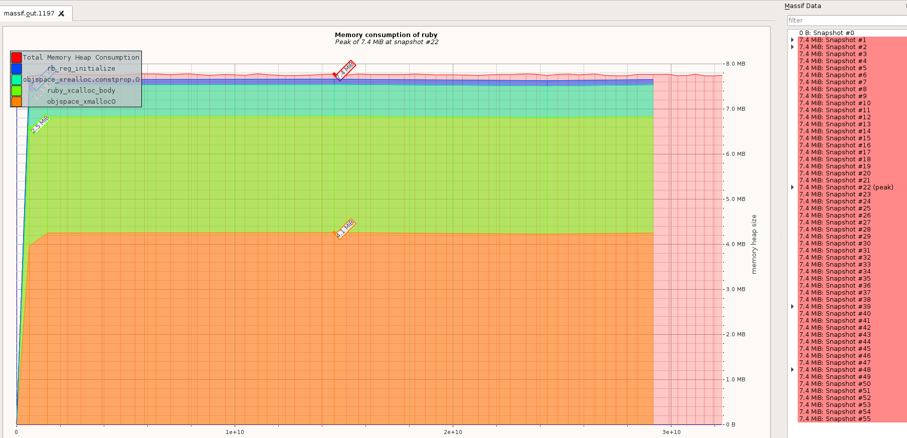

# Case-study оптимизации

## Актуальная проблема
В рамках домашнего задания дана программа, которая обрабатывает файл размером ~134 MB критично медленно и потребляет
слишком большое количество памяти.
Необходимо снизить потребление памяти данной программы до 70MB на исходном файле, при этом эта граница должна быть соблюдена во время работы всей программы.

## Формирование метрики
Для того, чтобы понимать, дают ли мои изменения положительный эффект на быстродействие программы я придумал использовать такую метрику: 
объем потребляемой памяти на обработке файла в 40MB. 
После предварительного замера потребляемой памяти на файле размером в 40MB (1_000_000 строк) результат составил 3667 MB.
Исходя из линейного роста ограничим бюджет на уровне 23MB.
Далее, в случае необходимости будем его уменьшать.

## Гарантия корректности работы оптимизированной программы
Программа поставлялась с тестом. Выполнение этого теста в фидбек-лупе позволяет не допустить изменения логики программы при оптимизации.
Также добавила тест из дз1, но на большем размере файла, чтобы не увеличить время обработки и сохранить линейную зависимость.

## Feedback-Loop
Для того, чтобы иметь возможность быстро проверять гипотезы я выстроил эффективный `feedback-loop`, который позволил мне получать обратную связь по эффективности сделанных изменений за *время, которое у вас получилось*

Вот как я построил `feedback_loop`:
- запуск профилировщика
- выявление главной точки роста
- внесение исправлений в код
- запуск тестов для проверки корректности работы скрипта и выполнения метрики по времени работы


## Вникаем в детали системы, чтобы найти главные точки роста
Прежде чем выполнять оптимизацию программы переделываю программу (за основу взяла оптимизированную программу из дз1).
Заношу все операции по сбору данных внутрь цикла File.foreach(file_path), запускаю тесты, чтобы убедиться в корректности 
правок и замеряю время выполнения:
```bash
File: data_part_1000000.txt
MEMORY USAGE: 398 MB
6.62
```
Интересный получился результат - после правок тесты от первого задания на 10000 строк перестали проходить по времени, 
но выполнение скрипта на конечном файле заняло всего 23.56.
Оптимизацию по методам решаю не применять, а попробовать оптимизировать по памяти.

Вот какие проблемы удалось найти и решить

### Ваша находка №1
Первый запуск профилировщика показал главную току роста:
```bash
MEMORY USAGE: 3667 MB
Total allocated: 1.33 GB (19438817 objects)
Total retained:  80.00 B (2 objects)

allocated memory by location
-----------------------------------
 554.50 MB  /opt/app/task-2.rb:34
```
Это строка с разбивкой строки из файла:
```ruby
cols = line.strip.split(',')
```
добавила frozen_string_literal: true (т.к много строк в профилировщике)
Вынесла line.stip! в начало и заменила обращение к cols[0] на line.include?, т.о занесла split внутрь блоков по сессии и пользователю

### Ваша находка №2
После запуска профилировщика снизилось потребление памяти и количество объектов.
```bash
MEMORY USAGE: 2426 MB
Total allocated: 990.39 MB (11957860 objects)
Total retained:  80.00 B (2 objects)

allocated memory by location
-----------------------------------
 372.34 MB  /opt/app/task-2.rb:49
```
Теперь выделяется строка:
```ruby
report['allBrowsers'] << session[:browser] unless report['allBrowsers'].include?(session[:browser])
```
Решаю избавиться от методов parse_session и parse_user и обращаться непосредственно к данным внутри массива, без создания доп хеша

### Ваша находка №3
После запуска профилировщика снизилось потребление памяти и количество объектов.
```bash
MEMORY USAGE: 2022 MB
Total allocated: 788.44 MB (10113726 objects)
Total retained:  80.00 B (2 objects)

allocated memory by location
-----------------------------------
 372.34 MB  /opt/app/task-2.rb:61
  90.36 MB  /opt/app/task-2.rb:92
```
Снова вернулся метод split в топ, решила пока его оставить и оптимизировать второе по потреблению памяти место:
это запись в файл результата. Убрала обертывание json в строку

### Ваша находка №4
После запуска профилировщика снизилось потребление памяти.
```bash
MEMORY USAGE: 1979 MB
Total allocated: 743.27 MB (10113725 objects)
Total retained:  80.00 B (2 objects)
```

Решила оптимизировать часть с финальным подсчетом информации для отчета. 
Здесь предстояла самая большая переделка кода, т.к. пришлось все обернуть в один класс и использовать запись в файл по мере
получения данных по пользователю.
В результате чего удалось снизить потребление памяти согласно профилировщику:

```bash
MEMORY USAGE: 1472 MB
Total allocated: 476.96 MB (8211797 objects)
Total retained:  40.00 B (1 objects)
```


## Результаты
В результате проделанной оптимизации наконец удалось обработать файл с данными.
Однако здесь с профилировщиками возникла проблема - на одном и том же файле они показывают разные результаты:
- при запуске memoryprofiler объем памяти показываеи 1472MB
- при запуске valgrind показывает 91MB
- при запуске benchmark - 19MB

При этом отчет valgrind показывает потребление меньше 8MB. Скриншот: 
Тем не менее время выполнения скрипта на исходном файле заметно сократилось - до 12.8 секунд

В данном задании полезным по сути был гем memory_profiler, для меня он показался наиболее удобным.

## Защита от регрессии производительности
Для защиты от потери достигнутого прогресса при дальнейших изменениях программы я оставила тесты от первого дз,
немного изменив файл для обработки.
