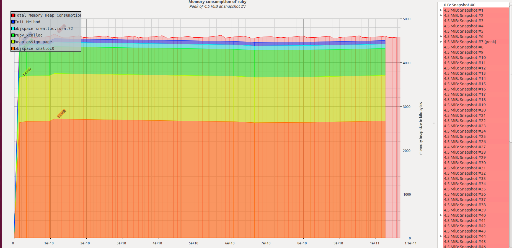

# Case-study оптимизации

## Актуальная проблема
В нашем проекте возникла серьёзная проблема.

Необходимо было обработать файл с данными, чуть больше ста мегабайт.

У нас уже была программа на `ruby`, которая умела делать нужную обработку.

Она успешно работала на файлах размером пару мегабайт, но для большого файла она работала слишком долго, и не было понятно, закончит ли она вообще работу за какое-то разумное время.

Я решил исправить эту проблему, оптимизировав эту программу.

## Формирование метрики
Для того, чтобы понимать, дают ли мои изменения положительный эффект на быстродействие программы я придумал использовать такую метрику:
Программа не должна потреблять больше 70Мб памяти при обработке файла в течение всей своей работы.
## Гарантия корректности работы оптимизированной программы
Программа поставлялась с тестом. Выполнение этого теста в фидбек-лупе позволяет не допустить изменения логики программы при оптимизации.

## Feedback-Loop
Для того, чтобы иметь возможность быстро проверять гипотезы я выстроил эффективный `feedback-loop`, который позволил мне получать обратную связь по эффективности сделанных изменений за *время, которое у вас получилось*

Вот как я построил `feedback_loop`:

1) Профилирование программы на объеме данных, который в данный момент обрабатывается не более 5 сек
2) Улучшение алгоритма в точках роста
3) Тестирование корректности работы программы (task-2-test.rb)
4) После достижения определенных успехов проверка заданного бюджета на реальном объеме данных

## Checklist
- [x] Построить и проанализировать отчёт гемом `memory_profiler`
- [x] Построить и проанализировать отчёт `ruby-prof` в режиме `Flat`;
- [x] Построить и проанализировать отчёт `ruby-prof` в режиме `Graph`;
- [x] Построить и проанализировать отчёт `ruby-prof` в режиме `CallStack`;
- [ ] Построить и проанализировать отчёт `ruby-prof` в режиме `CallTree` c визуализацией в `QCachegrind`;
- [ ] Построить и проанализировать текстовый отчёт `stackprof`;
- [ ] Построить и проанализировать отчёт `flamegraph` с помощью `stackprof` и визуализировать его в `speedscope.app`;
- [x] Построить график потребления памяти в `valgrind massif visualier` и включить скриншот в описание вашего `PR`;
- [x] Написать тест, на то что программа укладывается в бюджет по памяти

## Вникаем в детали системы, чтобы найти главные точки роста
Для того, чтобы найти "точки роста" для оптимизации я воспользовался инструментом memory_profiler, valgrind
Также в качестве эксперимента был испробован ruby-prof в разных режимах.

Вот какие проблемы удалось найти и решить

### Первый проход на объеме 20_000 строк с помощью memory_profiler
Главной точкой роста является:

`sessions = sessions + [parse_session(line)] if cols[0] == 'session'`

Данное место аллоцирует 95% всей памяти при работе программы

По итогу объем аллоцируемой памяти упал в 3 раза (1700мб -> 560мб)

### Второй проход на объеме 20_000 строк с помощью memory_profiler
Следующая точка роста:
 
 `user_sessions = sessions.select { |session| session['user_id'] == user['id'] }`
 
Около 80% всей памяти.

Отказываемся от хранения сессий в массиве в пользу хэша.

Объем аллоцируемой памяти 560мб -> 277мб

### Третий проход на объеме 20_000 строк с помощью memory_profiler

Главные точки роста

`@users = users + [parse_user(line)] if cols[0] == 'user'`

`users_objects = users_objects + [user_object]`

`{ 'dates' => user.sessions.map{|s| s['date']}.map {|d| Date.parse(d)}.sort.reverse.map { |d| d.iso8601 } }`

После устранения 277мб -> 165мб
C уменьшением аллокации памяти уменьшается время выполнения программы

# Дальнейшие подходы

Приходим к коду, похожему на код, полученный при профилировании по процессорному времени.
В итоге программа на 20_000 строках аллоцирует ~26 мб
На всем объеме данных ~2гб, таким образом пробуем переписать программу в потоковом стиле

# Первые результаты после рефакторинга в потоковом стиле

После того как программу переписали в потоковом стиле аллокация памяти на всем объеме данных ~ 515мб
Время выполнения 13.47

valgrind показывает что программа разрастается до 484мб в пике
Избавимся от всех мест где создаются лишние локальные переменные, массивы и т.д.

## Результаты
В результате проделанной оптимизации наконец удалось обработать файл с данными.

Отчет valgrind показал что программа в пике потребляет около 4,5мб независимо от объема файла,
таким образом удалось избежать утечек памяти

Количество памяти в конце выполнения программы по другой оценке ~ 8мб
Таким образом, мы уложились в заданную метрику

## Защита от регрессии производительности

Написан тест task-assert-performance.rb на то, что программа потребляет меньше 15 мб памяти при обработке файла в 100_000 строк